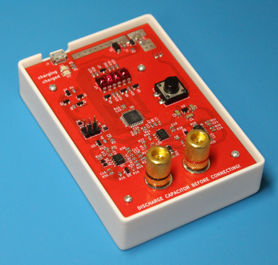

# ESR meter

Yet another ESR meter. Like most of such meters, it just measures the
impedance at 100 kHz. It's not for laboratory measurements, but
for quick finding bad electrolytic capacitors.

- The test signal is a 100 kHz sine wave
- Open terminals voltage is 50 mVpp (ok for in-circuit measurements, safe
  for polarized caps)
- Short terminals current is 5 mApp
- Rechargeable by USB
- Sexy HP bubble display (it's the main feature)

## Usage

To switch the meter on or off, press the button.

On startup, the meter performs a self-test. Keep the terminals open. During the
test, the meter turn on all the segments on the display, then shows an error if
any. Errors are:

- `E.rEF`: something wrong with voltage references or ADC;
- `E.F.LO`: low fuel (battery voltage < 3.3 V);
- `E.Prb`: something wrong with the test signal (or the terminals aren't open).

When the test is passed, the meter shows the current battery level in percents
as `F <level>`.

During normal operation the meter continuously shows the measured resistance
(ESR) in ohms, or `-OL-` if it's more than 99.99 ohms.

To compensate leads resistance (set zero), short the leads and long press the
button (> 0.5 seconds). You can't compensate more than 2 ohms (locked by
software to keep acceptable accuracy) — find a better leads or connect
capacitors directly to the binding post. If the meter fails to compensate,
it shows `SHIt` (stands for "your leads are shit").

To charge the meter use any USB charger capable to source 300 mA.

## How it works

See the [circuit diagram](hardware/circuit-diagram.pdf).

Basically, we connect the capacitor under test in a voltage divider,
formed by the output impedance *R* of the test signal source
and the capacitor. If *v* is the output voltage of the divider,
and *u* is the output voltage of the signal source, then the equivalent
impedance of the capacitor is *Rv/(u-v)*. We can measure *u* as the
output voltage of the divider when the terminals are open.
Note that the only physical reference in the equation is *R*. Any common
multiplier of *u* and *v* cancels out — only the ratio of *u*
and *v* matters.

The sine test signal is generated by a Wien bridge oscillator.
AGC loop sets a constant amplitude, which is referenced
to an external voltage reference. The circuit is basically taken
from Jim Williams' great article "Max Wien, Mr. Hewlett,
and a Rainy Sunday Afternoon".

To measure the output voltage of the divider, we amplify it
and then pass through a peak detector to get its amplitude.

The rest of the circuit is trivial.

## License

Unless otherwise noted, this work is licensed under Creative Commons Zero 1.0.

